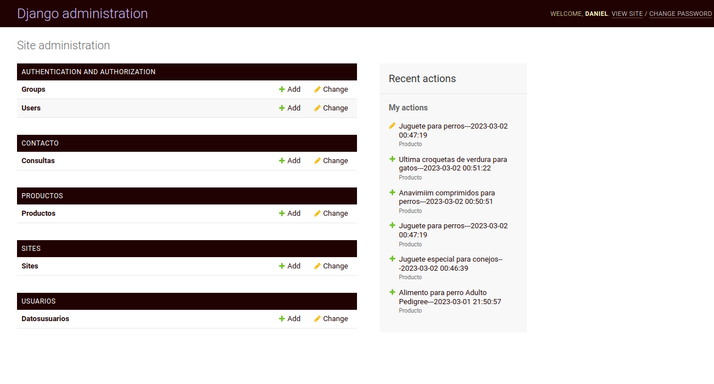

# tuVeterinaria

tuVeterinaria is a Django web app e-commerce platform created for educational purposes during my Diploma studies at the [UTN](https://www.frba.utn.edu.ar/).

## Preview

#### Landing Page

#### Product Search 

#### Admin Page 


## Features

- **User Registration and Login:** Secure authentication system for users.
- **Customized Admin Page:** Easy management of products, categories, and orders.
- **Product Sections:** Dedicated sections for Food, Accessories, and Pharmacy products.
- **Product Search:** Efficient search functionality powered by Ajax for real-time results.
- **Modern UI:** Styles and animations using [GreenSock Animation Platform](https://greensock.com/), SASS, and Bootstrap.
- **Unique Design:** Original design created from scratch. The Figma source is [available](https://www.figma.com/design/siyM2a68nuTt1syVqaN1Ao/tuVeterinaria?node-id=0-1).

## How to Run It

1. **Clone the repository:**

    ```bash
    git clone https://github.com/dPenedo/tuveterinaria
    ```

2. **Navigate to the project directory:**

    ```bash
    cd tuveterinaria
    ```

3. **Create a Python virtual environment:**

    ```bash
    python -m venv env
    ```

4. **Give executable permissions to the virtual environment:**

    ```bash
    chmod +x env/bin/activate
    ```

5. **Activate the virtual environment:**

    ```bash
    source env/bin/activate
    ```

6. **Install the dependencies:**

    ```bash
    pip install -r requirements.txt
    ```

7. **Run the application on a local server:**

    ```bash
    python manage.py runserver
    ```


## Technologies Used

- **Django:** Backend framework.
- **SQLite:** Data base
- **Python:** Programming language.
- **JavaScript & Ajax:** For dynamic content and real-time updates.
- **HTML & CSS:** Structure and styling of the web app.
- **SASS:** CSS pre-processor for advanced styling.
- **Bootstrap:** Front-end component library.
- **GreenSock Animation Platform (GSAP):** For animations and transitions.
- **Figma:** Design and prototyping tool.

## License

This project is licensed under the MIT License - see the [MIT license](https://opensource.org/license/mit).


---
## Contact
For more information, visit my [website](https://dpenedo.com) where you can find my portfolio, blog, and contact options. See the [LICENSE](LICENSE) file for details.
